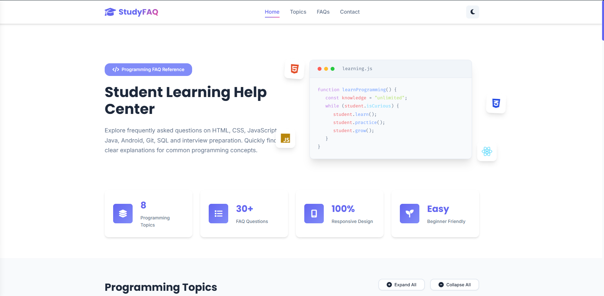
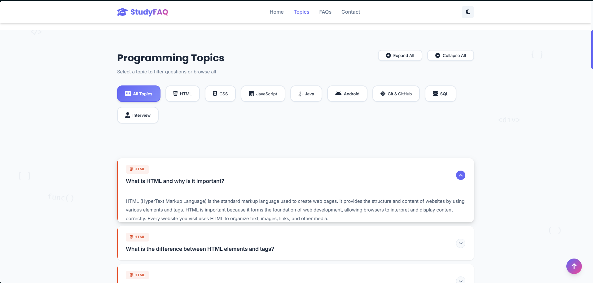
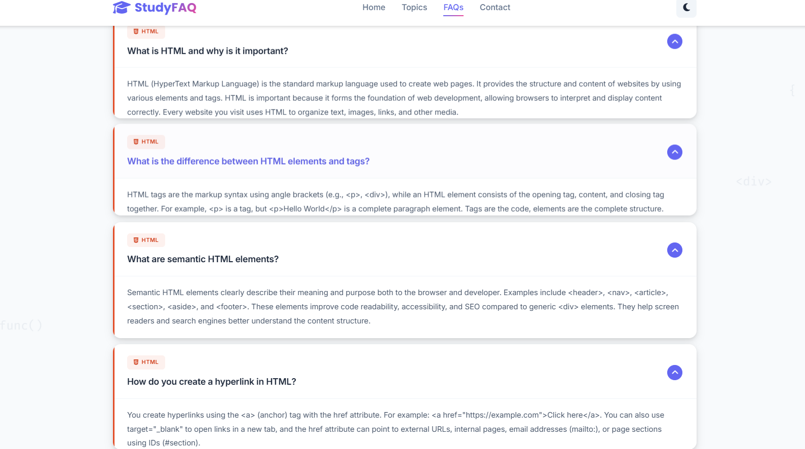
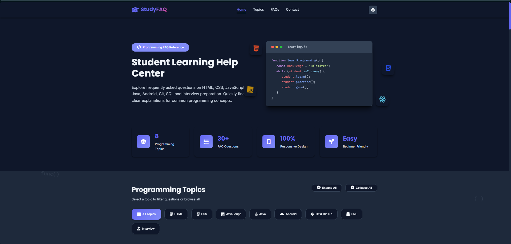

#  StudyFAQ - Student Learning Help Center

A modern and responsive FAQ website designed to help students quickly find answers to common programming questions. The project features categorized FAQs, an interactive accordion interface, dark mode, smooth animations, and a clean user-friendly design.

##  Live Demo

🔗 https://your-live-demo-link.com

## Screenshots
### Home


### Programming Topics


### FAQ Section


### Dark Mode


## Features

- Programming FAQ collection
- Category-based filtering
- Interactive accordion
- Dark / Light mode
- Fully responsive design
- Smooth animations
- Modern UI
- Fast loading
- Beginner-friendly interface

---

##  Built With

- HTML5
- CSS3
- JavaScript (ES6)
- Font Awesome Icons
- Google Fonts

---

##  Project Structure

```text
StudyFAQ/
│
├── assets/
│   └── screenshots/
│       ├── home.png
│       ├── topics.png
│       ├── faq.png
│       └── darkmode.png
│
├── css/
│   └── style.css
│
├── js/
│   └── main.js
│
├── index.html
└── README.md
```

---

##  Getting Started

### Clone the repository

```bash
git clone  https://github.com/Vaibhavigund/studyfaq-accordion-widget.git
```

### Open the project

Simply open

```
index.html
```

in your browser.

No installation or dependencies are required.

---

## Usage

- Browse programming topics.
- Filter FAQs using category buttons.
- Expand or collapse answers.
- Switch between Light and Dark mode.
- Explore programming concepts in an organized layout.

---

## Future Improvements

- Add more programming languages
- Search functionality
- Bookmark favorite questions
- Backend integration
- User authentication
- Admin panel for managing FAQs


